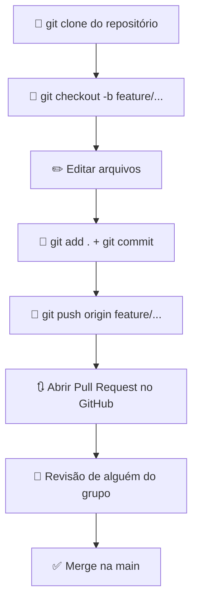

<p align="center">
  
</p>

<h1 align="center"><b>🌈 Prisma Cursos</b></h1>

## 📁 Estrutura

```
PrismaCursos/
├── index.html          ← Página principal (abra no navegador)
├── css/
│   ├── styles.css      ← Estilos (edite aqui)
│   └── scss/           ← Opcional: para quem quiser usar SCSS
│       ├── styles.scss
│       └── compilar-scss.sh
├── js/
│   └── main.js         ← JavaScript
├── assets/             ← Imagens e recursos
└── .gitignore
```

## 🚀 Como Rodar

Abra o `index.html` no navegador. Pronto.

> **VS Code?** Instale a extensão **Live Server** e clique em **Go Live**.

---

## 🔀 Git — Comandos Essenciais

### Primeira vez? Configure seu nome

```bash
git config --global user.name "Seu Nome"
git config --global user.email "seuemail@example.com"
```

### Clonar o repositório

```bash
git clone https://github.com/EduLoboM/Orcestra-2026.1-G04-PrismaCursos.git
cd Orcestra-2026.1-G04-PrismaCursos
```

### Criar sua branch e trabalhar nela

```bash
git checkout -b feature/minha-tarefa    # cria e já entra na branch
```

**Nomes de branch:**

| Prefixo | Uso | Exemplo |
|---------|-----|---------|
| `feature/` | Funcionalidade nova | `feature/pagina-cursos` |
| `fix/` | Correção | `fix/navbar-mobile` |
| `style/` | Visual | `style/cores-footer` |

### Salvar seu trabalho (commit + push)

```bash
git add .
git commit -m "feat: adiciona cards de cursos"
git push origin feature/minha-tarefa
```

### Tipos de commit

| Tipo | Uso | Exemplo |
|------|-----|---------|
| `feat` | Funcionalidade | `feat: cria seção de cursos` |
| `fix` | Correção | `fix: link quebrado no menu` |
| `style` | Visual | `style: ajusta cores do footer` |
| `docs` | Documentação | `docs: atualiza README` |
| `refactor` | Reorganização | `refactor: separa estilos do hero` |
| `chore` | Manutenção | `chore: atualiza gitignore` |

### Atualizar sua branch com a main

```bash
git checkout main
git pull origin main
git checkout feature/minha-tarefa
git merge main
```

### Trocar de branch

```bash
git checkout nome-da-branch
```

### Ver suas branches

```bash
git branch
```

---

## 🔃 Fluxo de Trabalho



1. Faça `push` da sua branch
2. Vá no GitHub → **Compare & pull request**
3. Descreva o que fez
4. Peça revisão de alguém do grupo

> ⚠️ **Nunca dê commit direto na `main`!** Sempre use branches.

---

## ✅ Dicas Rápidas

- Commits **pequenos e frequentes** > um commit gigante
- Use tags semânticas no HTML (`<header>`, `<main>`, `<section>`, `<footer>`)
- Use as variáveis CSS do `:root` para cores e espaçamentos
- Use `const` e `let` no JS, **nunca** `var`
- **Comunique no grupo** o que está fazendo pra não duplicar trabalho

---

## 🎨 SCSS (opcional)

Se quiser usar SCSS ao invés de CSS puro, edite `css/scss/styles.scss` e compile:

```bash
# Instalar o compilador (uma vez só)
sudo apt install sass          # Linux
brew install sass/sass/sass    # Mac
choco install sass             # Windows

# Compilar
cd css/scss
./compilar-scss.sh             # compila uma vez
./compilar-scss.sh --watch     # recompila automaticamente
```

> Se não quiser usar SCSS, ignore a pasta `css/scss/` e edite o `css/styles.css` direto.

---

## 👥 Equipe

| Nome | GitHub |
|------|--------|
| Eduardo Lobo Moreira | [EduLoboM](https://github.com/EduLoboM) |
| Júlia Trevizolo | [JuliaTrevizolo](https://github.com/JuliaTrevizolo) |
| Lucas Oliveira de Paula | [dev-LucasDpaula](https://github.com/dev-LucasDpaula) |
| Mariane | [marianeb08](https://github.com/marianeb08) |
| Pedro dos Santos | [pedrossantoss](https://github.com/pedrossantoss) |
| Vitor Rossi | [VitorRoss1](https://github.com/VitorRoss1) |